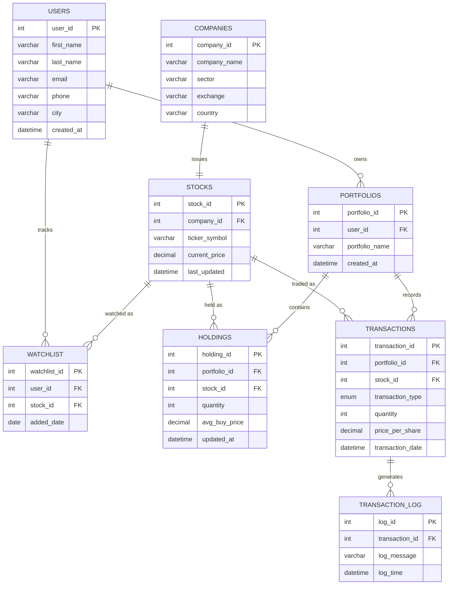

# Phase 2 — ER Diagram
## Financial Portfolio Management System

### Entity-Relationship Diagram (Mermaid)

### Cardinality Summary

| Relationship | Type | Notes |
|---|---|---|
| Users → Portfolios | 1:M | A user can open multiple portfolios |
| Companies → Stocks | 1:1 | Kept as two tables for normalization (see below) |
| Portfolios → Holdings | 1:M | A portfolio holds many stocks |
| Stocks → Holdings | 1:M | A stock can be held in many portfolios |
| Portfolios → Transactions | 1:M | A portfolio has a history of trades |
| Stocks → Transactions | 1:M | A stock is traded across many transactions |
| Users ↔ Stocks (via Watchlist) | M:M | Resolved through the `watchlist` junction table |
| Transactions → Transaction_Log | 1:M | Every transaction generates a log row (via trigger) |

### Why Companies and Stocks Are Separate Tables

- **Companies** holds slowly-changing descriptive data: name, sector, exchange, country.
- **Stocks** holds fast-changing trading data: ticker symbol, current price, last updated timestamp.
- Mixing them would mean re-writing static company info every time a price updates — a normalization smell (updating one fact shouldn't risk touching unrelated facts). Separating them keeps each table focused on one theme, satisfying 3NF.

### Why Holdings Is a Separate Table (Not Just Computed Live)

`Holdings` is a **derived/summary** table: `quantity` and `avg_buy_price` per portfolio+stock could technically be recalculated from `Transactions` every time. Keeping a maintained summary table is a deliberate design choice to demonstrate:
- Stored procedures that keep derived data in sync (Phase 11)
- The trade-off between normalized "single source of truth" (Transactions) and a denormalized-for-performance summary (Holdings) — a very common real-world pattern interviewers like to probe.

### Normalization Check (3NF)

- **1NF**: Every column holds a single atomic value (no comma-separated tickers, no repeating groups). Watchlist is a proper junction table rather than a multi-valued column.
- **2NF**: Every table has a single-column surrogate primary key (`*_id`), so no partial-key dependency issues exist.
- **3NF**: No transitive dependencies — e.g., `sector` depends only on `company_id`, not on `stock_id`; `current_price` depends only on `stock_id`, not on any transaction.

---
### Interview Questions
1. Walk me through the cardinality between Portfolios and Holdings, and why.
2. Why keep a `transaction_log` table separate from `transactions` instead of adding a `status` column to `transactions`?
3. How does this schema handle the many-to-many relationship between Users and Stocks?
4. What would break if `sector` were stored on the `stocks` table instead of `companies`?

### Common Mistakes
- Drawing a direct FK from `Users` to `Holdings`/`Transactions` instead of going through `Portfolios` — loses the "a user can have multiple portfolios" business rule.
- Forgetting `Watchlist` needs its own surrogate key + a UNIQUE constraint on `(user_id, stock_id)` to prevent duplicate watch entries.
- Making `Companies`→`Stocks` a 1:M "for future-proofing" without a real requirement — over-engineering beyond what was asked.
